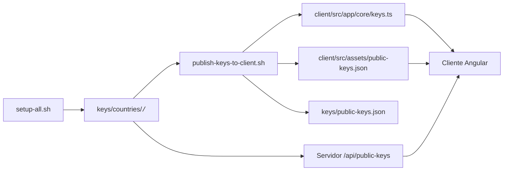

# Cliente — TFG Multimedia (resumen y simulación)

Aplicación Angular (standalone) que actúa como interfaz de votación y cliente P2P para pruebas locales.

## Requisitos
- Node.js 18+
- npm
- Navegador moderno con WebRTC y Web Crypto API
- Backend corriendo en puertos 3001..3005
- MongoDB accesible desde los backends

## Instalación y arranque rápido
1. Instalar dependencias:
```bash
cd client
npm ci
```
2. Arrancar en modo desarrollo:
```bash
cd client
npm start
```
3. Abrir en el navegador:
```text
http://localhost:4200
```

## Flujo completo de una votación simulada

Esta aplicación no funciona sola: además de tener el cliente arrancado, necesitas preparar el backend, generar claves, crear votantes de prueba, configurar el periodo de votación y ejecutar la simulación de votantes.

### 1. Instalar dependencias del servidor y Playwright

El script de simulación usa Playwright desde el servidor. Instala las dependencias y el navegador Chromium:

```bash
cd server
npm ci
npx playwright install chromium
```

### 2. Generar claves y datos de prueba de backend

Puedes usar el script de setup completo o ejecutar los pasos individuales.

#### Opción A: Setup completo

```bash
cd server
bash scripts/setup-all.sh
```

Esto hace:
- genera las claves país en `keys/countries/<code>/`
- genera claves privadas de votantes en `keys/voters/<country>/`
- carga la configuración de votación desde `server/edition-config/ESC_2026.json`
- crea 30 votantes de demo por país

#### Opción B: Pasos manuales

```bash
cd server
npm run keys:es
npm run keys-encryption:es
npm run keys:fr
npm run keys-encryption:fr
# ... repetir para de, pt, it
npm run seed-voting:all
npm run seed-voters:es
npm run seed-voters:fr
npm run seed-voters:de
npm run seed-voters:pt
npm run seed-voters:it
```

### 3. Ajustar el periodo de votación

El archivo `server/edition-config/ESC_2026.json` define el periodo de votación (`votingStart` y `votingEnd`). Si las fechas están en el pasado, el cliente no permitirá votar.

Edita el archivo y pon fechas futuras o actuales:

```bash
nano server/edition-config/ESC_2026.json
```

Ejemplo:
```json
{
  "votingStart": "2026-05-24T10:00:00Z",
  "votingEnd": "2026-05-25T22:00:00Z",
  ...
}
```

Después de modificarlo, recarga la configuración en todas las BDs:

```bash
cd server
npm run seed-voting:all
```

### 4. Publicar las claves públicas en el cliente

El cliente necesita las claves públicas de los países para validar la firma y el cifrado. Publica esas claves desde el servidor:

```bash
cd server
bash scripts/publish-keys-to-client.sh
```

Esto genera:
- `client/src/app/core/keys.ts`
- `client/src/assets/public-keys.json`
- `keys/public-keys.json`

### 5. Arrancar los servicios necesarios

Para que la simulación sea completa, deben estar levantados:
- MongoDB
- los 5 backends de país (3001..3005)
- el cliente Angular en 4200

Puedes usar el orquestador desde la raíz:

```bash
bash scripts/start-everything.sh --start-mongo --logs
```

O arrancar manualmente:

```bash
cd server
npm run dev:es
npm run dev:fr
npm run dev:de
npm run dev:pt
npm run dev:it
```

y en otra terminal:

```bash
cd client
npm start
```

### 6. Ejecutar la simulación de votantes con Playwright

El script de simulación abre navegadores Chromium controlados automáticamente, completa los formularios de login y votación, y participa en las rondas P2P.

```bash
cd server
npm run demo-voters -- es 5
```

Esto hará que 5 votantes de España (`es-1` a `es-5`) "voten" automáticamente.

También tienes comandos específicos ya definidos:

```bash
cd server
npm run demo-voters:es:30
npm run demo-voters:fr:30
npm run demo-voters:de:30
npm run demo-voters:pt:30
npm run demo-voters:it:30
```

### 7. Qué hace la simulación exactamente

El script de simulación:
- utiliza los votantes generados en `server/keys/voters/<country>/`
- utiliza la contraseña común `TFG_Pass_Segura6983985()·$=` para todos los demo users
- abre una sesión de Chromium por votante con Playwright
- rellena `voterId`, `secretCode` y sube la clave privada
- selecciona entre 1 y 3 países para votar
- confirma el voto
- participa en el protocolo P2P del cliente

### 8. Consideraciones importantes

- La votación solo funciona si `ESC_2026.json` tiene un periodo válido.
- Si los servicios país no están todos disponibles, la simulación puede fallar o quedarse a medias.
- Si reusas el mismo votante en múltiples ejecuciones, Playwright almacena perfiles en el `tmp` del sistema. Borra los directorios `tfg-voter-*` en el directorio temporal si quieres reiniciar la sesión limpia.

## Integración con el backend
- Generar claves y seed de datos en el servidor antes de iniciar el cliente:
  ```bash
  cd server
  bash scripts/setup-all.sh
  ```
- Alternativamente, usar el orquestador desde la raíz:
  ```bash
  bash scripts/start-everything.sh --start-mongo --logs
  ```

## Claves públicas
- Las claves públicas de los países se generan en `keys/countries/<code>/` por `setup-all.sh`.
- Para pruebas locales, el script `server/scripts/publish-keys-to-client.sh` inyecta las claves públicas en `client/src/app/core/keys.ts` (archivo requerido por el cliente).
- También se crea un asset JSON en `client/src/assets/public-keys.json` para uso alternativo.

## Flujo de claves públicas
1. Generar claves y seed en el servidor:
   ```bash
   cd server
   bash scripts/setup-all.sh
   ```
2. Publicar las claves en el cliente:
   ```bash
   bash server/scripts/publish-keys-to-client.sh
   ```
3. Iniciar el cliente Angular:
   ```bash
   cd client
   npm start
   ```
4. El cliente usa `client/src/app/core/keys.ts` para acceder a las claves públicas en desarrollo.



## Endpoint runtime de claves públicas
- Cada backend también expone `/api/public-keys`.
- Esto permite validar o consultar claves sin depender solo del fichero TypeScript generado.

## Configuración y cambios de país
- La configuración de API/puertos está en `client/src/app/core/config/api.config.ts`.
- Cambiar país (desde la consola del navegador):
  ```javascript
  localStorage.setItem('tfg_country', 'fr');
  location.reload();
  ```

## Credenciales de demo
- Usuario: `es-1`, contraseña: `TFG_Pass_Segura6983985()·$=` (votantes generados por `seed-voters`)

## Comandos útiles desde la raíz del repo
- `bash scripts/start-everything.sh --start-mongo --logs` — setup + arranque (recomendado)
- `bash scripts/start-all-countries.sh` — abrir 5 servidores en terminales
- `bash scripts/stop-everything.sh` — detener procesos relacionados

## Problemas frecuentes
- "Could not resolve '../keys'": ejecutar `cd server && bash scripts/setup-all.sh` o crear `client/src/app/core/keys.ts`.
- Errores de WebSocket o CORS: comprobar que el servidor país está arrancado y que la URL/puerto configurados coinciden.

## Referencia rápida
- Server README: [server/README.md](../server/README.md)
- Scripts: [server/scripts/README.md](../server/scripts/README.md)

