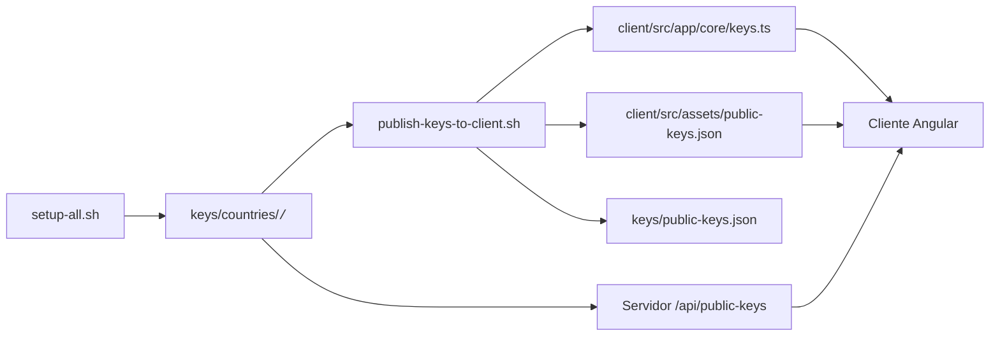

# Servidor — TFG Multimedia

Servidor Node.js (Express + WebSocket) que implementa la lógica backend para las pruebas locales: autenticación de votantes, emisión de tokens, configuración de votación, publicación/consulta de bloques públicos y signaling P2P en `/signaling`.

Requisitos
- Node.js 18+
- npm
- MongoDB accesible (local o Docker) en `localhost:27017`

Archivos clave
- `server/src/index.js` — entrada principal
- `server/src/app/createExpressApp.js` — configuración de Express y rutas
- `server/src/app/countryServer.js` — crea HTTP server y WebSocket
- `server/src/signaling/*` — lógica de signaling y gestión de rondas P2P
- `server/src/services/*` — lógica de negocio (auth, tokens, blockchain)
- `server/src/models/*` — esquemas Mongoose (Voter, Session, PublicBlock, VotingConfig)
- `server/env/.<country>.env` — variables por país (PORT, DATABASE_URI, passphrases...)

Variables por país importantes
- `DATABASE_URI` — URI de MongoDB (ej.: `mongodb://127.0.0.1:27017/tfg_es`)
- `COUNTRY_KEY_PASSPHRASE` / `COUNTRY_ENCRYPTION_KEY_PASSPHRASE` — passphrases para claves
- `COUNTRY_CODE`, `PORT`, `HOSTNAME`, `EDITION_CODE`

Generación de claves (resumen)
- Las claves se crean en `keys/countries/<code>/`.
- Comandos:
  ```bash
  cd server
  npm run keys:es              # Ed25519 (firma)
  npm run keys-encryption:es   # RSA-OAEP (encriptación)
  ```

Seeding y datos de prueba
- Cargar configuración de votación:
  `npm run seed-voting:es` o `npm run seed-voting:all`
- Crear votantes de demo (genera claves privadas en `keys/voters/<country>`):
  `npm run seed-voters:es`

Arranque
- Arrancar un país (carga su `.env` automáticamente):
  ```bash
  cd server
  npm run dev:es     # con nodemon
  # o sin nodemon
  node scripts/start-country.js es
  ```
- Arrancar todos los países (desde la raíz):
  ```bash
  bash scripts/start-all-countries.sh
  ```

Endpoints principales (resumen)
- `GET /` — health check
- `POST /api/auth/login` — login de votante (devuelve `sessionToken`)
- `POST /api/token` — solicitar token (requiere `Authorization`)
- `GET /api/voting-config` — configuración de votación (auth)
- `GET/POST /api/blockchain/blocks` — consultar/publicar bloques

Signaling WebSocket
- WS en `ws://<HOSTNAME>:<PORT>/signaling` — mensajes definidos en `server/src/signaling/*.js`

Publicar claves al cliente
- Para pruebas locales se dispone de `server/scripts/publish-keys-to-client.sh`, que genera `client/src/app/core/keys.ts` con las claves públicas inyectadas. Esto facilita el arranque del cliente en desarrollo.
- El script también escribe:
  - `client/src/assets/public-keys.json`
  - `keys/public-keys.json`
- Además, cada backend expone un endpoint runtime en `/api/public-keys` para consultar las claves públicas desde el servidor.

Flujo de publicación de claves
1. Ejecutar `cd server && bash scripts/setup-all.sh` para generar las claves en `keys/countries/<code>/`.
2. Ejecutar `bash server/scripts/publish-keys-to-client.sh` para enviar las claves al cliente.
3. Arrancar el cliente con `cd client && npm start`.
4. Si es necesario, el cliente puede obtener claves en tiempo de ejecución desde `/api/public-keys` en cada backend.



> Nota: Para ejecutar una votación simulada completa necesitas además configurar el periodo de votación en `server/edition-config/ESC_2026.json`, seedear la configuración, crear votantes simulados y ejecutar los scripts de Playwright (`demo-voters`).
> Consulta la guía de simulación resumida en `client/README.md` o el README principal del proyecto.

## Preparación de una votación

La configuración de votación (fechas, candidatos, información) se almacena en `server/edition-config/ESC_2026.json`. Después de ejecutar `setup-all.sh`, este archivo se carga en la base de datos de cada país.

### Configurar fechas de votación

Por defecto, `ESC_2026.json` contiene fechas en el futuro (abril–mayo 2026). Si necesitas ejecutar una votación ahora:

**Opción 1: Editar manualmente `edition-config/ESC_2026.json`**

```bash
# Abre el archivo y modifica votingStart y votingEnd a fechas futuras
nano server/edition-config/ESC_2026.json
```

Busca estas líneas y actualízalas:
```json
{
  "votingStart": "2026-04-26T10:00:00Z",
  "votingEnd": "2026-05-21T22:00:00Z",
  ...
}
```

Cámbia a:
```json
{
  "votingStart": "2024-12-18T10:00:00Z",
  "votingEnd": "2024-12-20T22:00:00Z",
  ...
}
```

**Opción 2: Usar sed (una línea, todas las fechas)**

```bash
# Reemplazar año 2026 por 2024 en todas las fechas
sed -i.bak 's/"2026-/"2024-/g' server/edition-config/ESC_2026.json

# Verificar cambios
grep "voting" server/edition-config/ESC_2026.json | head -4
```

### Recargar configuración en las bases de datos

Una vez editadas las fechas, recarga la configuración en todos los países:

```bash
cd server
npm run seed-voting:all
```

Este comando:
1. Lee `edition-config/ESC_2026.json`
2. Carga/actualiza la configuración en cada base de datos (`tfg_es`, `tfg_fr`, `tfg_de`, `tfg_pt`, `tfg_it`)
3. Imprime confirmación por país

Ejemplo de salida:
```
🌍 Loading voting config for country: es
✅ Voting config loaded: ES 2026 - Eurofestival
...
🌍 Loading voting config for country: it
✅ Voting config loaded: ES 2026 - Eurofestival
```

### Verificar que la votación está configurada

1. **Desde el cliente Angular**: Después de arrancar el cliente (`npm start` en `client/`), autentica con un votante y verifica que el estado sea "Votación abierta" (no "no iniciada" ni "finalizada").

2. **Desde la API**: Consulta el servidor directamente:
   ```bash
   curl -s http://localhost:3001/api/voting-config | jq .votingStart
   # Debe mostrar una fecha futura respecto a ahora
   ```

3. **Desde MongoDB**: Conéctate a la BD y verifica:
   ```bash
   mongo tfg_es
   db.votingconfigs.findOne()
   ```
   Comprueba que `votingStart` y `votingEnd` rodean la hora actual.

Scripts recomendados
- Setup automático (genera claves, configura y crea votantes):
  `cd server && bash scripts/setup-all.sh`
- Limpieza destructiva de BDs (usar con cuidado):
  `cd server && bash scripts/clean-all.sh`

Problemas frecuentes
- MongoDB no conecta: comprueba `DATABASE_URI` en `server/env/.<country>.env` o arranca un contenedor MongoDB.
- Errores de passphrase: las passphrases deben coincidir con las utilizadas al generar claves.

Guía rápida de uso
1. `docker run -d --name mongo -p 27017:27017 -v mongodata:/data/db mongo:6.0`
2. `cd server && bash scripts/setup-all.sh`
3. `npm run dev:es` (o usar el orquestador desde la raíz)

Para más detalles sobre cada script utilice: [server/scripts/README.md](scripts/README.md)
